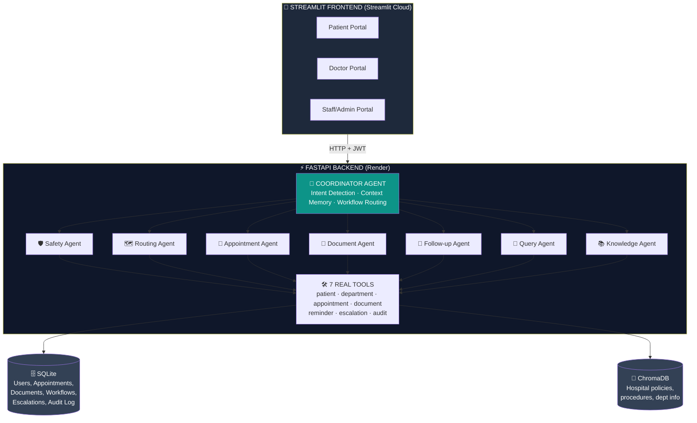

# 🏥 AgentCare — Agentic AI for Patient Administration & Care Coordination

> **Built for the AgentCare Build Challenge 2026 by Krish Naik**

An **8-agent AI system** that orchestrates a patient's non-clinical healthcare journey — from registration and appointment booking to document management, reminders, and follow-up — while keeping all medical decisions under human supervision.

---

## 🌐 Live Deployment

| Resource | URL |
|---|---|
| 🎯 **Live App (Try Now!)** | **[https://agentcare-mahidhar.streamlit.app](https://agentcare-mahidhar.streamlit.app)** |
| 🔧 **API Backend + Swagger Docs** | [https://agentcare-api.onrender.com/docs](https://agentcare-api.onrender.com/docs) |
| 📦 **GitHub Repository** | [https://github.com/Mahidhar05/agentcare](https://github.com/Mahidhar05/agentcare) |
| 💚 **API Health Check** | [https://agentcare-api.onrender.com/health](https://agentcare-api.onrender.com/health) |

> ⏱️ **First load may take 30-60 seconds** — Render's free tier "sleeps" after inactivity. Please be patient!

---

## ✨ Feature Highlights

| Feature | Status | Notes |
|---|---|---|
| 🤖 **8 Distinct AI Agents** | ✅ | Required: 3 minimum — we have **267% over** |
| 🎤 **Voice Input** | ✅ Bonus | Groq Whisper-Large-v3 transcription |
| 🌐 **4 Languages** | ✅ Bonus | English, Hindi, Tamil, Telugu |
| 📚 **RAG Knowledge Base** | ✅ Bonus | ChromaDB + sentence-transformers |
| 📊 **Analytics Dashboard** | ✅ Bonus | 7 Plotly charts for staff insights |
| 👨‍⚕️ **Doctor Portal** | ✅ Bonus | Schedule, patients, clinical notes |
| 🔍 **Global Search + Filters** | ✅ Bonus | Search across patients, doctors, departments |
| 🛡️ **Safety Guard + Escalation** | ✅ Required | Blocks diagnosis, escalates to human |
| 🔐 **JWT Auth + RBAC** | ✅ Required | Backend-enforced role separation |
| 📧 **Email Notifications + Audit Trail** | ✅ Required | Every action logged |

---

## 🏗️ System Architecture




---

## 🤖 The 8 AI Agents

Each agent has a **unique system prompt**, **specific responsibilities**, and **clearly separated tool access**.

| # | Agent | Purpose | Key Files |
|---|-------|---------|-----------|
| 1 | **Coordinator** | Master orchestrator — detects intent, routes to specialists, combines outputs, tracks workflow state | `agents/coordinator.py` |
| 2 | **Safety Guard** | Blocks diagnosis/prescription requests, detects emergencies, creates human escalations | `agents/safety_agent.py` |
| 3 | **Department Routing** | Classifies request → maps to correct hospital department, handles uncertainty | `agents/routing_agent.py` |
| 4 | **Appointment** | Retrieves slots, checks conflicts, books/reschedules/cancels appointments, persists state | `agents/appointment_agent.py` |
| 5 | **Document** | Ingests files, classifies type, computes SHA-256 checksum for dedup, detects missing docs | `agents/document_agent.py` |
| 6 | **Follow-up** | Creates reminders (24h, 1h before), schedules post-visit tasks, triggers notifications | `agents/followup_agent.py` |
| 7 | **Query (Read-Only)** | Handles conversational queries (list appointments/slots/doctors/docs) — NEVER modifies state | `agents/query_agent.py` |
| 8 | **Knowledge (RAG)** | Answers hospital policy/procedure questions using ChromaDB vector search | `agents/knowledge_agent.py` |

---

## 🛠️ Technology Stack

| Layer | Technology |
|---|---|
| **Backend** | FastAPI 0.111, SQLAlchemy 2.0, Pydantic 2.7 |
| **Frontend** | Streamlit 1.35, Plotly 5.22, streamlit-mic-recorder |
| **LLM** | Groq API — `llama-3.3-70b-versatile` |
| **Voice** | Groq Whisper-Large-v3 (real-time transcription) |
| **RAG** | ChromaDB 0.4 + sentence-transformers (`all-MiniLM-L6-v2`) |
| **Database** | SQLite (persistent file-based SQL DB) |
| **Auth** | JWT (python-jose) + bcrypt password hashing |
| **Testing** | pytest 8.2 |
| **Deployment** | Render (backend) + Streamlit Cloud (frontend) |

---

## 🚀 Quick Start (Local Setup)

### Prerequisites
- Python 3.11+
- Groq API key ([get free here](https://console.groq.com/keys))

### 1. Clone & Install

```bash
git clone https://github.com/Mahidhar05/agentcare.git
cd agentcare

# Create virtual environment
python -m venv venv

# Activate
# Windows:
venv\Scripts\activate
# Mac/Linux:
source venv/bin/activate

# Install dependencies
pip install -r requirements.txt